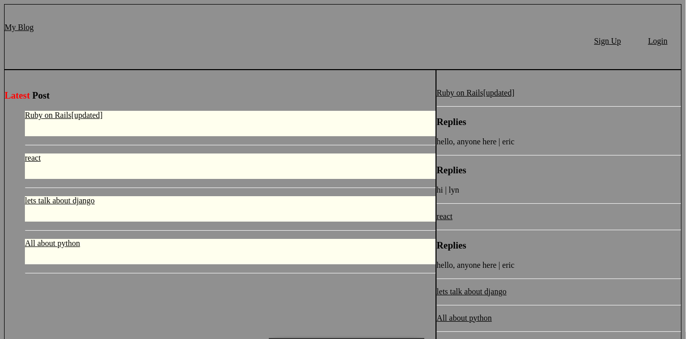

## Django Blog

## Description
- The purpose of this project is to test my ability on how well i understood django, this project has less styling but more functions. The CRUD operations was implement.
	+ Users can create new post
	+ Users can read post
	+ Users can update post
	+ Users can delete post
	+ Users can comment and delete comments
	+ A Users cant delete a post or comments which is not theirs
	+ Register/Login authentication was implemented
## Installation
+ Clone this repo ans `cd` to the cloned repository's directory
+ Run `python install -r requirements.txt

## Usage
+ `python manage.py makemigrations`
+ `python manage.py migrate`
+ Run `python manage.py runserver` to run the app
